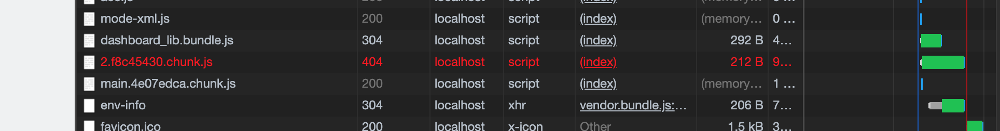
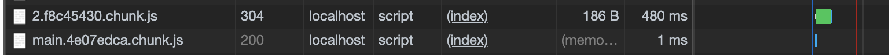

<!-- TODO: -->
# Components tutorial for kubeflow

## Requirments

- tensorflow 2.2.0
- pytorch 1.15
- openMPI 4.0.1
- horovod 0.19
- spark 2.4.5
- kustomize 3.6.1 ([installation](https://kubernetes-sigs.github.io/kustomize/installation/))
- kfctl 1.0.2 ([installation](https://www.kubeflow.org/docs/started/k8s/kfctl-k8s-istio/))
- kubenetes (1.14 recommanded)

## Installation

- [kustomize](https://kubernetes-sigs.github.io/kustomize/) installation and add to PATH (3.6.1) ([3.2.1](https://github.com/kubernetes-sigs/kustomize/releases/tag/kustomize%2Fv3.2.1) recommended just for now)

  ```bash
  curl -s "https://raw.githubusercontent.com/kubernetes-sigs/kustomize/master/hack/install_kustomize.sh"  | bash
  ```

- kfctl installation and add to PATH

  ```bash
  $ wget https://github.com/kubeflow/kfctl/releases/download/v1.0.2/kfctl_v1.0.2-0-ga476281_linux.tar.gz
  # tar -xvf kfctl_v1.0.2_<platform>.tar.gz
  $ tar -xvf kfctl_v1.0.2-0-ga476281_linux.tar.gz
  ```
- install canal and modify the config map to solve coredns failure
  - install canal

    ```bash
    $ kubectl apply -f https://docs.projectcalico.org/v3.8/manifests/canal.yaml
    $ kubectl get po -n kube-system
    # NAME                                     READY   STATUS    RESTARTS   AGE
    # ...
    # coredns-6dcc67dcbc-rrhn2                 1/1     Running   1          46d
    # coredns-6dcc67dcbc-wjf29                 1/1     Running   1          46d
    # ...
    ```

  - if those pod `CrashLoopBackOff`

    ```bash
    $ kubectl edit cm coredns -n kube-system
    # # Please edit the object below. Lines beginning with a '#' will be ignored,
    # # and an empty file will abort the edit. If an error occurs while saving this file will be
    # # reopened with the relevant failures.
    # #
    # apiVersion: v1
    # data:
    #   Corefile: |
    #     .:53 {
    #         errors
    #         health
    #         kubernetes cluster.local in-addr.arpa ip6.arpa {
    #           pods insecure
    #           upstream
    #           fallthrough in-addr.arpa ip6.arpa
    #         }
    #         prometheus :9153
    #         forward . /etc/resolv.conf
    #         cache 30
    #         loop -------------------- this should be gone.
    #         reload
    #         loadbalance
    #     }
    # kind: ConfigMap
    # metadata:
    #   creationTimestamp: "2020-05-09T06:48:11Z"
    #   name: coredns
    #   namespace: kube-system
    #   resourceVersion: "174"
    #   selfLink: /api/v1/namespaces/kube-system/configmaps/coredns
    #   uid: 0cb15eee-91c1-11ea-9c47-fa163e79ab21
    ```

- install local-path-storage-class
  - create default local storage class [Reference](https://github.com/rancher/local-path-provisioner)

    ```bash
    $ mkdir local-path-sc
    $ cd local-path-sc
    $ wget https://raw.githubusercontent.com/rancher/local-path-provisioner/master/deploy/local-path-storage.yaml
    ```

  - modified local-path-storage 
  <!-- - (maybe change namespace to kubeflow ? ) -->

    ```yaml
    ...
    apiVersion: storage.k8s.io/v1
    kind: StorageClass
    metadata:
      name: local-path
     ######### modify ############### this is for default storage class
      annotations:
        storageclass.kubernetes.io/is-default-class: "true"
     ######### modify ###############
    provisioner: rancher.io/local-path
    volumeBindingMode: WaitForFirstConsumer
    reclaimPolicy: Delete
    ---
    kind: ConfigMap
    apiVersion: v1
    metadata:
      name: local-path-config
      namespace: local-path-storage
    data:
      config.json: |-
            {
                    "nodePathMap":[
                    {
                            "node":"DEFAULT_PATH_FOR_NON_LISTED_NODES",
                            ######### modify ###############
                            "paths":["/home/sdev/kubeflow-pv"] # need to edit this to your own path
                            ######### modify ###############
                    }
                    ]
            }
    ```

  - create the path or directory on every node of k8s

    ```bash
    $ ssh recaller-2 -t "mkdir -p /home/sdev/kubeflow-pv"
    $ ssh recaller-3 -t "mkdir -p /home/sdev/kubeflow-pv"
    $ ssh recaller-4 -t "mkdir -p /home/sdev/kubeflow-pv"
    $ ssh recaller-7 -t "mkdir -p /home/sdev/kubeflow-pv"
    $ ssh recaller-8 -t "mkdir -p /home/sdev/kubeflow-pv"
    ```

  - apply local storage class

    ```bash
    $ kubectl apply -f local-path-storage.yaml
    ```
  
  - test local-path-storage-class

    ```bash
    $ kubectl create -f https://raw.githubusercontent.com/rancher/local-path-provisioner/master/examples/pvc.yaml
    $ kubectl create -f https://raw.githubusercontent.com/rancher/local-path-provisioner/master/examples/pod.yaml
    $ kubectl get pv
    # NAME                                       CAPACITY   ACCESS MODES   RECLAIM POLICY   STATUS   CLAIM                    STORAGECLASS   REASON   AGE
    # pvc-86f4aa99-b603-11ea-8c52-fa163e79ab21   2Gi        RWO            Delete           Bound    default/local-path-pvc   local-path              0s
    $ kubectl delete -f https://raw.githubusercontent.com/rancher/local-path-provisioner/master/examples/pod.yaml
    $ kubectl delete -f https://raw.githubusercontent.com/rancher/local-path-provisioner/master/examples/pvc.yaml
    $ kubectl get sc #(default is really important)
    # NAME                   PROVISIONER             AGE
    # local-path (default)   rancher.io/local-path   4m15s
    ```


- installation (kubeflow == 0.7.1, 1.0.2)
  
  ```bash
  $ mkdir -p kfinstallation && cd kfinstallation
  $ export PATH=$PATH:`pwd`
  # export KF_NAME=<your choice of name for the Kubeflow deployment>
  $ export KF_NAME=kfprog
  # export BASE_DIR=<path to a base directory>
  $ export BASE_DIR=`pwd`
  $ export KF_DIR=${BASE_DIR}/${KF_NAME}
  $ export CONFIG_URI=https://raw.githubusercontent.com/kubeflow/manifests/v0.7-branch/kfdef/kfctl_k8s_istio.0.7.1.yaml
  $ mkdir -p ${KF_DIR}
  $ cd ${KF_DIR}
  $ kfctl apply -V -f ${CONFIG_URI}
  ```

- fix the metadata-deployment failed and pass user & password
  - check status

    ```bash
    $ kubectl get all -n kubeflow
    # NAME                                                               READY   STATUS    RESTARTS   AGE
    # ...
    # pod/metadata-deployment-7648dc5c96-xvq4n                           0/1     Running   0          2m3s
    # ...
    # deployment.apps/metadata-deployment                           0/1     1            0           2m6s
    # ...
    ```

    ```bash
    $ kubectl logs pod/metadata-deployment-7648dc5c96-xvq4n -n kubeflow
    # E0624 10:39:53.756374       1 main.go:98] Failed to create ML Metadata Store: mysql_real_connect failed: errno: 2005, error: Unknown MySQL server host 'metadata-db.kubeflow' (-3).
    # Retry 1/10.
    # Sleep 1.052s
    # E0624 10:40:34.848769       1 main.go:98] Failed to create ML Metadata Store: mysql_real_connect failed: errno: 2005, error: Unknown MySQL server host 'metadata-db.kubeflow' (-3).
    # Retry 2/10.
    # Sleep 2.44s
    # E0624 10:41:17.328199       1 main.go:98] Failed to create ML Metadata Store: mysql_real_connect failed: errno: 2005, error: Unknown MySQL server host 'metadata-db.kubeflow' (-3).
    # Retry 3/10.
    # Sleep 4.329s
    # E0624 10:42:01.689021       1 main.go:98] Failed to create ML Metadata Store: mysql_real_connect failed: errno: 2005, error: Unknown MySQL server host 'metadata-db.kubeflow' (-3).
    # Retry 4/10.
    # Sleep 7.75s
    # E0624 10:42:49.478563       1 main.go:98] Failed to create ML Metadata Store: mysql_real_connect failed: errno: 2005, error: Unknown MySQL server host 'metadata-db.kubeflow' (-3).
    # Retry 5/10.
    # Sleep 15.397s
    # E0624 10:43:44.910419       1 main.go:98] Failed to create ML Metadata Store: mysql_real_connect failed: errno: 2005, error: Unknown MySQL server host 'metadata-db.kubeflow' (-3).
    # Retry 6/10.
    # Sleep 34.989s
    # E0624 10:44:59.928293       1 main.go:98] Failed to create ML Metadata Store: mysql_real_connect failed: errno: 2005, error: Unknown MySQL server host 'metadata-db.kubeflow' (-3).
    # Retry 7/10.
    # Sleep 50.1s
    # E0624 10:46:30.061770       1 main.go:98] Failed to create ML Metadata Store: mysql_real_connect failed: errno: 2005, error: Unknown MySQL server host 'metadata-db.kubeflow' (-3).
    # Retry 8/10.
    # Sleep 1m46.017s
    ```

  - fix it 
    - download kubeflow/manifest

    ```bash
    $ git clone -b v0.8-branch https://github.com/kubeflow/manifests
    $ cd manifests/metadata/base/
    $ kubectl delete -k . # because v0.8-branch is not supported by kustomize 3.6.1
    ```

    - modify the `metadata-deployment.yaml`

      ```yaml
      apiVersion: apps/v1
      kind: Deployment
      metadata:
        name: deployment
        labels:
          component: server
      spec:
        replicas: 1
        selector:
          matchLabels:
            component: server
        template:
          metadata:
            labels:
              component: server
          spec:
            containers:
            - name: container
              image: gcr.io/kubeflow-images-public/metadata:v0.1.11
              ######### modify ############### add "-mysql_service_host=<service/metadata-db IP>", "-mysql_service_password=test",
              command: ["./server/server", "-mysql_service_host=10.97.8.101", "-mysql_service_password=test",
                        "--http_port=8080"]
              ######### modify ###############
              ports:
              - name: backendapi
                containerPort: 8080

              readinessProbe:
                httpGet:
                  path: /api/v1alpha1/artifact_types
                  port: backendapi
                  httpHeaders:
                  - name: ContentType
                    value: application/json
                initialDelaySeconds: 3
                periodSeconds: 5
                timeoutSeconds: 2
      ---
      ...
      ```

    - apply it

      ```bash
      $ kubectl apply -k .
      ```

- TroubleShooting
  - Katib db faild
    [https://github.com/kubeflow/katib/issues/1115](https://github.com/kubeflow/katib/issues/1115)
    [https://github.com/kubeflow/katib/pull/1006](https://github.com/kubeflow/katib/pull/1006)
    [you can reinstall katlib with kubeflow/manifests](https://github.com/kubeflow/manifests/tree/master/katib/katib-crds/base)
    [https://github.com/kubeflow/katib/issues/696](https://github.com/kubeflow/katib/issues/696)
    [https://github.com/kubeflow/kubeflow/issues/4864]()

  - centraldashboard CrashLoopBackOff
    [https://github.com/kubeflow/kubeflow/issues/4819](https://github.com/kubeflow/kubeflow/issues/4819)
    ```bash
    $ kubectl -n kubeflow set image deployment/centraldashboard centraldashboard=gsantomaggio/centraldashboard:node-12
    ```

  - Katib not show anything
    - [reinstall katib](https://www.kubeflow.org/docs/components/hyperparameter-tuning/hyperparameter/)
    
      ```bash
      $ git clone https://github.com/kubeflow/katib
      $ cd ./katib/manifests/v1alpha3/ui
      $ kubectl delete -f .
      $ kubectl apply -f .
      ```

    - first, in general, there is some probelm with katib-ui deployment which means the pod
    - find problem with google chrome (404)
      - the problem from name comfusion.
      
        *Note that this picture is working not for troubles.*

        

    - enter katib-ui pod

      ```bash
      docker ps | grep katib #(find the `katib-ui` pod)
      # e1c374e5211a        gcr.io/kubeflow-images-public/katib/v1alpha3/katib-ui   "./katib-ui --port=8…"   19 hours ago        Up 19 hours                             k8s_katib-ui_katib-ui-55566448cb-sqjfr_kubeflow_3fc3daa9-1af4-4401-a6d2-2b060ed8f421_0
      # 022f93e6e968        k8s.gcr.io/pause:3.1                                    "/pause"                 19 hours ago        Up 19 hours                             k8s_POD_katib-ui-55566448cb-sqjfr_kubeflow_3fc3daa9-1af4-4401-a6d2-2b060ed8f421_0
      $ docker exec -it --user root e1c374e5211a sh
      /app # cd build/static/js/
      ## modified the name of files
      /app # cp 2.eb2df79f.chunk.js 2.f8c45430.chunk.js
      ```
    here is correct
    

## deletion

- please do not use `kfctl delete -f kfctl_k8s_istio.v1.0.2.yaml` only
- please remove pv, all namespace about kubeflow, and use `kustomize/` to delete crd.

## Access WebUI

1. access through port-forwarding
   - ssh to remote server and start kube-proxy port-forwarding
   - Use the following command to set up port forwarding to the Istio gateway.

    ```bash
     $ export NAMESPACE=istio-system
     $ kubectl port-forward -n istio-system svc/istio-ingressgateway 8080:80
     ```

   - Access the central navigation dashboard at:

     ```http://localhost:8080/``` on the remote server.

   - access WebUI on your own computer through ssh forwarding

     ```bash
     $ ssh -L 8008:localhost:8080 recaller-2
     # ssh -NT -L 8008:localhost:8080 recaller-2
     ```

2. check the port in the istio-system namespace

  ```bash
  $ kubectl get svc -n istio-system
  # NAME                       TYPE           CLUSTER-IP       EXTERNAL-IP   PORT(S)                                                                                                                                                                                   AGE
  # cluster-local-gateway      ClusterIP      10.107.15.184    <none>        80/TCP,443/TCP,31400/TCP,15011/TCP,8060/TCP,15029/TCP,15030/TCP,15031/TCP,15032/TCP                                                                                                       43h
  # ...
  # istio-ingressgateway       NodePort       10.101.38.62     <none>        15020:30542/TCP,80:31380/TCP,443:31390/TCP,31400:31400/TCP,15029:30857/TCP,15030:31719/TCP,15031:32540/TCP,15032:30218/TCP,15443:30275/TCP                                                43h
  #...
  # kfserving-ingressgateway   LoadBalancer   10.100.53.105    <pending>     15020:32151/TCP,80:32380/TCP,443:32390/TCP,31400:32400/TCP,15011:30551/TCP,8060:30340/TCP,853:30400/TCP,15029:30502/TCP,15030:30863/TCP,15031:30618/TCP,15032:30061/TCP,15443:30038/TCP   43h
  # ...
  ```
  - we can see `80:31380/TCP` at the line of istio-ingressgateway
  - so we can ssh port forward 8008->31380

  by doing this, you can access kubeflow with your own browser of [```http://localhost:8008```](http://localhost:8008)

## tutorial

- [mpi-operator](mpi-operator/README.md)
- [pytorch-operator](pytorch-operator/README.md)
- [spark-operator](spark-operator/README.md)
- [tf-operator](tf-operator/README.mds)
