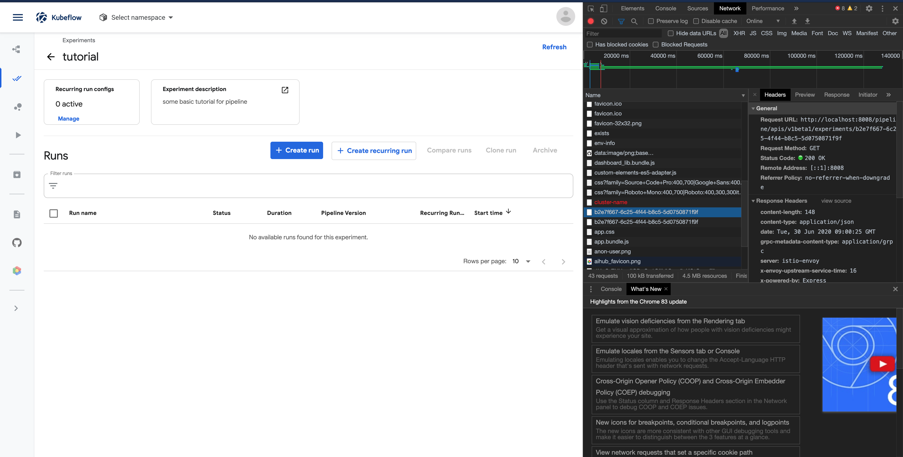

# Tutorial for kubeflow pipelines

# experiments and runs deletion

- need to delete all run under experiment and then delete experiment.
- [Restful api](https://www.kubeflow.org/docs/pipelines/reference/api/kubeflow-pipeline-api-spec/)
- deletion (ssh port-forward version) (the same as `run`)

  ```bash
  # curl -X {POST, GET, DELETE} http://<host:port/pipline>/apis/v1beta1/experiments/{id}
  # the `id` will be found in the web source file of the chrome browser
  $ curl -X DELETE http://localhost:8008/pipeline/apis/v1beta1/experiments/1aba4f11-fbd0-4a78-84cd-4123b21d75b7
  ```

  